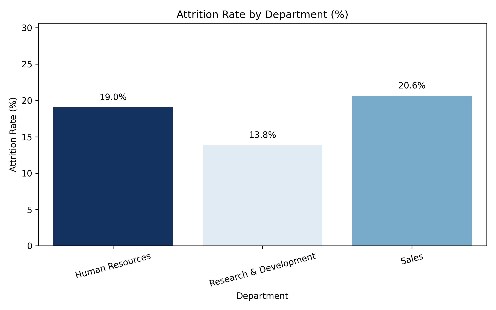
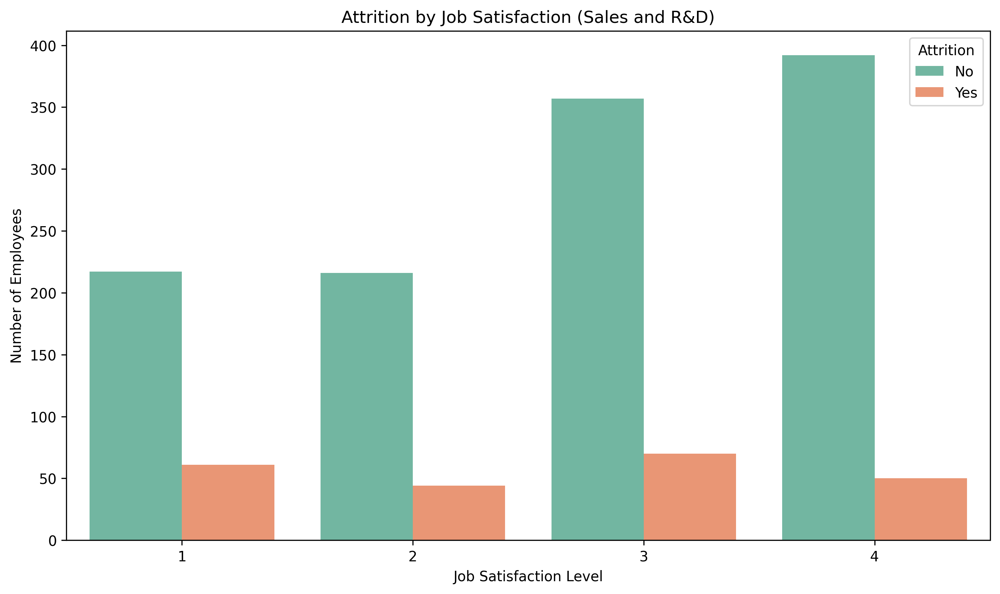
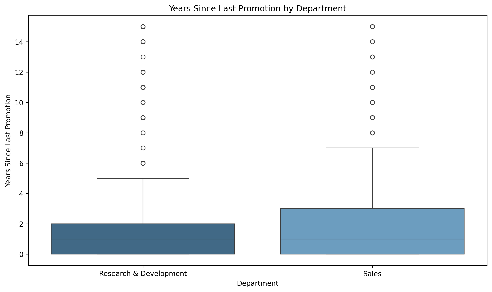
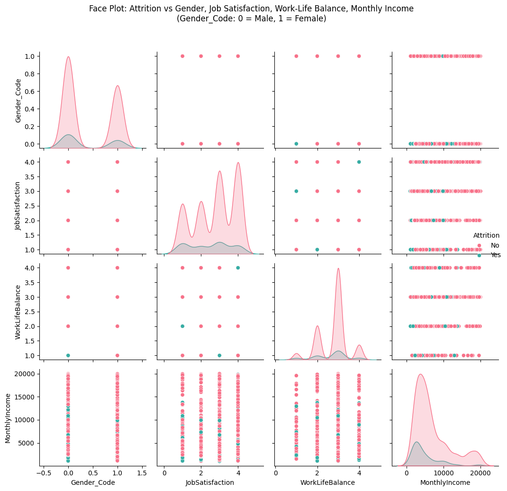

# 💼 Employee Attrition Analysis

This project focuses on understanding employee attrition using HR analytics data from IBM.  
We analyze key factors that contribute to employees leaving the company, such as:

- Job satisfaction
- Work-life balance
- Department
- Gender
- Monthly income
- Promotion 

The dataset used is from [IBM HR Analytics Employee Attrition & Performance](https://www.kaggle.com/datasets/pavansubhasht/ibm-hr-analytics-attrition-dataset).

---

## 📊 Visual Insights

### 📌 Attrition Rate by Department


### 📌 Attrition by Job Satisfaction and Gender


### 📌 Attrition by Promotion in Last 2 Years


### 📌 Attrition Distribution Face Plot



## 🧠 Key Findings

- Departments like **Sales** have the highest attrition rates.
- Employees with **low job satisfaction** or **poor work-life balance** are more likely to leave.
- **Lower monthly income** is strongly associated with higher attrition.
- **Employees who were not promoted in the last 2 years** have a significantly higher attrition rate.
- There are subtle differences in attrition patterns between **genders**.


## 📂 Project Structure

- `notebooks/` — analysis and visualizations in Jupyter
- `images/` — saved PNG charts for easy embedding
- `data/` — cleaned dataset
- `README.md` — project overview

---

## 🚀 How to Run

```bash
git clone https://github.com/melo4yxa77796/EmployeeProductivityAnalysis.git
cd EmployeeProductivityAnalysis
open notebooks/attrition_analysis.ipynb
